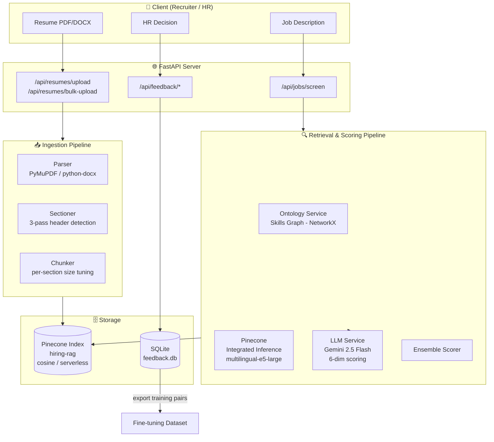
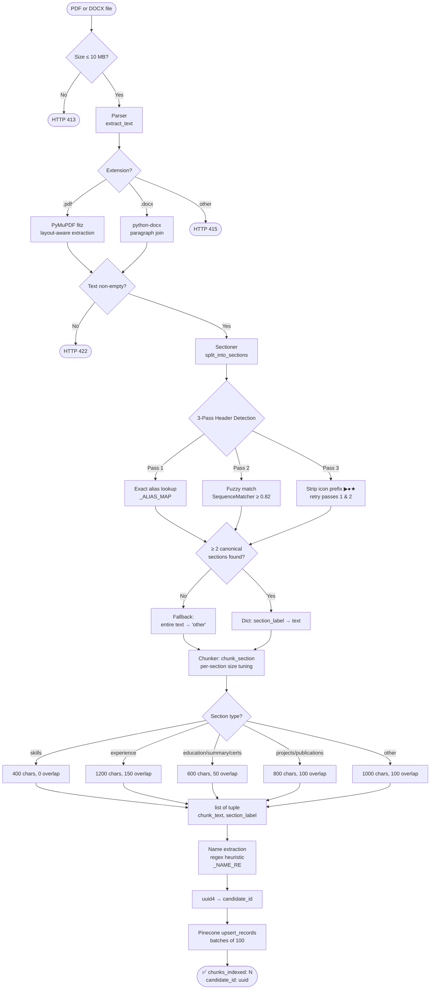
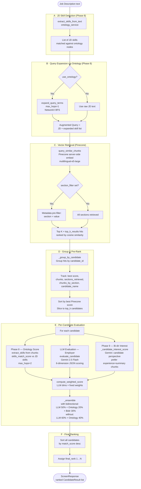
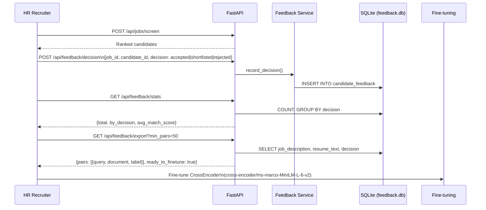
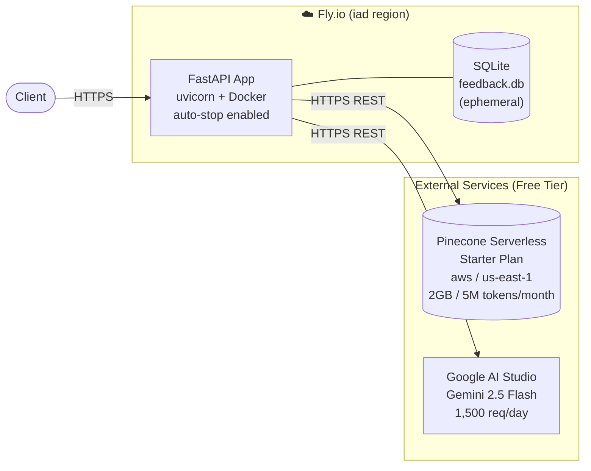

# RAG Hiring Server — Architecture Pipeline

> **Version**: v0.2.0 · FastAPI + Pinecone Integrated Inference + Gemini 2.5 Flash  
> **Deployment**: Fly.io (serverless) · **Storage**: Pinecone (vectors) + SQLite (feedback)

---

## 1. High-Level System Overview



---

## 2. Ingestion Pipeline (Resume Upload)

### Flow: `POST /api/resumes/upload` or `/bulk-upload`



### Key: Pinecone Record Schema

| Field | Description |
|---|---|
| `_id` | `{candidate_id}#chunk{i}` |
| `chunk_text` | Raw text sent to Pinecone for server-side embedding |
| `candidate_id` | UUID for the resume |
| `filename` | Original filename |
| `chunk_index` | Positional index within the resume |
| `section` | Canonical label: `experience`, `skills`, `education`, etc. |
| `candidate_name` | Heuristically extracted from the first lines |

---

## 3. Retrieval & Screening Pipeline (Job Screening)

### Flow: `POST /api/jobs/screen`



### LLM Dimension Weights (Employer Score)

| Dimension | Weight |
|---|---|
| `technical_skills_score` | 30% |
| `experience_relevance_score` | 25% |
| `experience_depth_score` | 15% |
| `education_score` | 10% |
| `certifications_score` | 10% |
| `communication_score` | 10% |

### Ensemble Score Formula

```
With bidirectional ON:
  bidir_score  = 0.70 × employer_score + 0.30 × candidate_interest_score
  final_score  = 0.50 × employer_score + 0.20 × (ontology_score × 100) + 0.30 × bidir_score

Without bidirectional:
  final_score  = 0.60 × employer_score + 0.40 × (ontology_score × 100)
```

---

## 4. Skills Ontology Graph (Phase 8)

The ontology is an in-memory directed graph (`networkx.DiGraph`) with **three edge types**:

| Edge Type | Example |
|---|---|
| `IS_A` | `FastAPI → REST Framework → REST API → API Development` |
| `ALIAS` | `K8s → Kubernetes` |
| `RELATED_TO` | `Deep Learning → MLOps` |

### Ontology Coverage

| Domain | Examples |
|---|---|
| API / Backend | REST API, GraphQL, gRPC, FastAPI, Flask, Spring Boot |
| Python Ecosystem | Django, SQLAlchemy, Pydantic, Celery, NumPy, Pandas |
| Cloud & Infra | AWS, GCP, Azure, Fly.io, Lambda, S3, EC2 |
| Container / DevOps | Docker, Kubernetes, Terraform, Helm, GitHub Actions |
| Data Engineering | Kafka, Spark, Airflow, dbt, Snowflake, BigQuery |
| ML / AI | PyTorch, TensorFlow, Scikit-learn, XGBoost, Hugging Face |
| LLM / Gen AI | LangChain, RAG, Pinecone, Weaviate, Prompt Engineering |
| Frontend | React, Vue.js, Next.js, TypeScript |
| Leadership | Scrum, Agile, Mentoring, Engineering Manager |

### How Query Expansion Works

```
JD skill: "REST API development"
  ↳ exact match: "REST API"
  ↳ 1-hop BFS: REST Framework, API Development
  ↳ children of REST Framework: FastAPI, Flask, Django REST Framework,
                                  Express.js, Spring Boot, ASP.NET Core, Rails API
Result: augmented query now surfaces candidates listing FastAPI even if
        the JD only says "REST API"
```

---

## 5. HR Feedback Loop (Phase 10)



### Feedback DB Schema

```sql
CREATE TABLE candidate_feedback (
    id               INTEGER PRIMARY KEY AUTOINCREMENT,
    job_id           TEXT NOT NULL,
    job_description  TEXT NOT NULL,
    candidate_id     TEXT NOT NULL,
    filename         TEXT DEFAULT '',
    resume_text      TEXT DEFAULT '',
    decision         TEXT CHECK(decision IN ('accepted','shortlisted','rejected')),
    match_score      REAL,
    dimension_scores TEXT,   -- JSON blob
    notes            TEXT,
    recruiter_id     TEXT,
    created_at       TEXT
);
```

### Export Label Mapping

| HR Decision | Fine-tune Label |
|---|---|
| `accepted` | `1` |
| `shortlisted` | `1` |
| `rejected` | `0` |

---

## 6. API Surface

| Method | Path | Description |
|---|---|---|
| `GET` | `/` | Health check / liveness probe |
| `POST` | `/api/resumes/upload` | Single resume upload (PDF/DOCX) |
| `POST` | `/api/resumes/bulk-upload` | Batch upload (up to 20 files) |
| `DELETE` | `/api/resumes/{candidate_id}` | Remove all vectors for a candidate |
| `POST` | `/api/jobs/screen` | Screen all indexed resumes against a JD |
| `POST` | `/api/feedback/decision` | Record one HR decision |
| `POST` | `/api/feedback/bulk` | Record multiple HR decisions |
| `GET` | `/api/feedback/stats` | Summary statistics |
| `GET` | `/api/feedback/export` | Export labelled pairs for fine-tuning |
| `GET` | `/api/feedback/decisions` | Query stored decisions (filterable) |

---

## 7. Component Map

```
Sample RAG Server/
├── src/
│   ├── main.py              FastAPI app, CORS middleware, router registration
│   ├── config.py            Centralised Settings from .env (chunk sizes, API keys, model names)
│   │
│   ├── routers/
│   │   ├── resumes.py       Upload pipeline orchestrator; single + bulk upload; delete
│   │   ├── jobs.py          Screening pipeline orchestrator; ontology + LLM + ensemble
│   │   └── feedback.py      Feedback CRUD; export endpoint
│   │
│   ├── services/
│   │   ├── pinecone_service.py   Lazy index creation; upsert_records; search; delete by prefix
│   │   ├── llm_service.py        Gemini client; 6-dimension prompt; weighted score
│   │   ├── ontology_service.py   NetworkX graph; expand_query_terms; skills_match_score
│   │   ├── feedback_service.py   SQLite persistence; export training pairs; stats
│   │   └── embedding_service.py  Stub — Pinecone handles embedding internally
│   │
│   └── utils/
│       ├── parser.py        PyMuPDF (PDF) + python-docx (DOCX) text extraction
│       ├── sectioner.py     3-pass section header classifier; fuzzy matching; fallback
│       └── chunker.py       RecursiveCharacterTextSplitter; per-section chunk params
│
└── tests/
    ├── test_api.py              Mocked endpoint integration tests
    ├── test_bulk_upload.py      Bulk upload edge cases
    ├── test_chunker.py          Chunking edge cases
    ├── test_parser.py           In-memory PDF/DOCX parsing
    ├── test_pinecone_service.py Pinecone service unit tests
    └── test_feedback.py         Feedback service + endpoint tests
```

---

## 8. Configuration Reference

All values configurable via `.env` (no code changes needed):

| Env Variable | Default | Description |
|---|---|---|
| `PINECONE_API_KEY` | — | Pinecone API key |
| `PINECONE_INDEX_NAME` | `hiring-rag` | Vector index name |
| `PINECONE_CLOUD` | `aws` | Cloud provider |
| `PINECONE_REGION` | `us-east-1` | Index region |
| `PINECONE_EMBEDDING_MODEL` | `multilingual-e5-large` | Server-side embedding model |
| `GOOGLE_API_KEY` | — | Gemini API key |
| `GEMINI_MODEL` | `gemini-2.5-flash` | Generation model |
| `MAX_UPLOAD_SIZE_MB` | `10` | Per-file size limit |
| `TOP_K_RESULTS` | `10` | Default Pinecone retrieval k |
| `CHUNK_SIZE_SKILLS` | `400` | Skills section chunk size |
| `CHUNK_SIZE_EXPERIENCE` | `1200` | Experience section chunk size |
| `CHUNK_SIZE_DEFAULT` | `1000` | Default section chunk size |
| `CHUNK_OVERLAP_DEFAULT` | `100` | Default chunk overlap |
| `FEEDBACK_DB_PATH` | `feedback.db` | SQLite database path |

---

## 9. Deployment Topology



> [!WARNING]
> SQLite (`feedback.db`) on Fly.io is **ephemeral** — it resets on redeploy. For production, swap `DB_PATH` to a mounted volume or migrate to PostgreSQL.

> [!TIP]
> Pinecone delete on the Starter (free) plan does **not** support filter-based deletes. The service works around this by using `index.list(prefix=candidate_id#)` to discover chunk IDs, then deletes them by explicit ID list.

---

## 10. Data Flow Summary

```
                      INGESTION
File ──► Parser ──► Sectioner ──► Chunker ──► Pinecone (embed + store)
         PDF/DOCX   9 sections   per-section  multilingual-e5-large
                    fuzzy match  size tuning  cosine, serverless

                      SCREENING
Job Description
  ──► Ontology (detect + expand JD skills)
  ──► Pinecone query (augmented query, optional section_filter)
  ──► Group hits by candidate
  ──► Per candidate:
        Ontology score  (skills_match_score, max_hops=2)
        LLM score       (Gemini, 6 dims, employer perspective)
        Interest score  (Gemini, candidate perspective, Phase 9)
        Ensemble        (50/20/30 or 60/40 weights)
  ──► Sort & rank ──► ScreenResponse

                      FEEDBACK LOOP
HR Decision ──► SQLite ──► export_training_pairs
                            ──► CrossEncoder fine-tuning dataset
```
